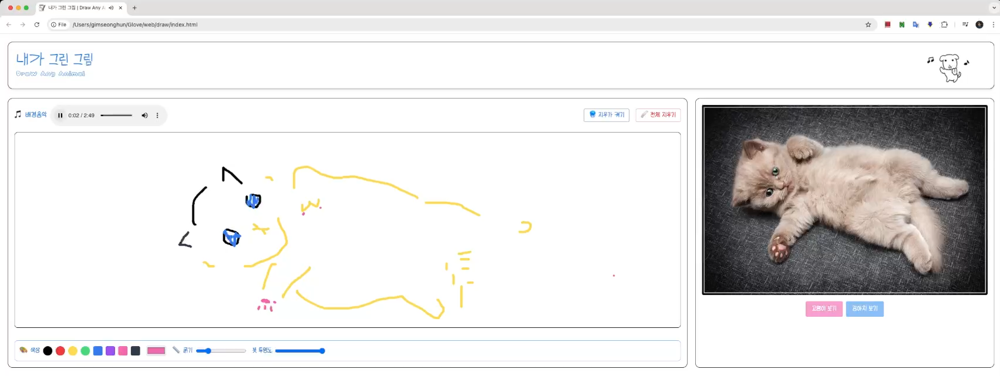

# 내가 그린 그림  DrawAnyAnimal
>HTML5 API(canvas, audio) 기능 제어하기
>

 | 
--|--|

[🔗 사이트 바로가기 (Render)](https://tony96kimsh.github.io/)

📘 [작업 로그(노션)](https://stump-smartphone-024.notion.site/HTML-5-1d0f398452c380a4b80dfd5fe4baa91a?pvs=4)

🗣 [발표자료: 준비 중]()

 ---

# 프로젝트 소개
- 설치없이 누구나 쉽게 사용가능한 웹 환경에서 이용하는 그림판 어플리케이션
- 귀엽고 깔끔한 디자인과 밝은 배경음악으로 친근한 분위기 제공 
- 강아지와 고양이 사진 API를 통해 특색있는 그림판 앱 제공

### 기술 스택
- javascript: canvasAPI, Audio.API, openAPI (fetchAPI)
- Tailwind

## 주요 기능
1. canvas API를 통한 그림판 기능
    - 붓 색상, 굵기, 투명도, 지우개 기능 제공
2. 고양이, 강아지 API를 통해 다양한 참고 동물 사진 제공
3. Audio API를 통한 배경음악 기능 제공

## 구조

### 레이아웃 구조


### 폴더구조

```tree
── README.md
├── 📁bg // 샘플 배경 음악
├── 📁img // 샘플이미지
├── index.html
└── src
    ├── audio.js // 배경음악 제어
    ├── canvas.js // 그림판 제어
    └── photo.js // 사진 API 제어
```

### 코드 구조
#### audio
```javascript
// 동적으로 오디오 요소 생성
...createElement('audio'); 
// 문서의 구조(DOM)가 모두 완성되었을 때 실행되는 코드
window.addEventListener('DOMContentLoaded', () => {})

const musicList = [];
// 처음 곡 설정
audioElement.src = musicList[currentIndex];

// 다음 곡으로 넘어가기
audioElement.addEventListener('ended', () => {
  currentIndex = (currentIndex + 1) % musicList.length; // 다음 곡 인덱스
  audioElement.src = musicList[currentIndex];
  audioElement.play(); // 수동 재생 필요!
});

window.addEventListener('DOMContentLoaded', () => {
  const container = document.getElementById('musicPlayer');
  if (container) {
    container.appendChild(audioElement);
  }
});
```

#### canvas
```javascript

```

#### photo
```javscript
```

## 추후 작업 및 이슈

### 추후 작업
기능 추가 사항
- 현재 그리는 그림 로컬스토리지에 저장 기능
- 캔버스에 동물 사진 배경 기능 (따라 그리기 기능)
- 창 사이즈 조절 시, 레이아웃 자동 조절 기능
- 터치를 통한 캔버스 제어 기능

보완 사항
- 음악 재생 시, 연속 재생 및 반복 재생
- 캔버스 드로우 중 영역 벗어났다가 돌아올 시 브러쉬 유지하기

### 이슈
 - (QA 확인중...)


### 레퍼런스

- 사진
    - [핀터레스트 - 춤추는 강아지 ](https://kr.pinterest.com/pin/20195898325337996/)
- 폰트
    - [눈누 - 어비 찌빠빠체](https://noonnu.cc/font_page/160)
    - [눈누 - Cafe24 Meongi White](https://noonnu.cc/font_page/1403)
    - [눈누 - 온글잎 콘콘체](https://noonnu.cc/font_page/1546)
- 아이콘
    - [프리픽 - 파비콘](https://www.freepik.com/icon/sketchbook_6994399#fromView=search&page=1&position=41&uuid=9cf6df0d-0622-4012-a7db-9e8ed3676d29)
- 배경음악
    - [유튜브 오디오 라이브러리 - BGM](https://studio.youtube.com/channel/UCo3j6bBQz09Hy7eNkARd3yg/music)